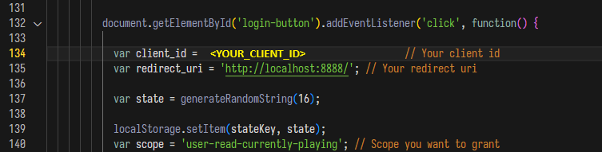
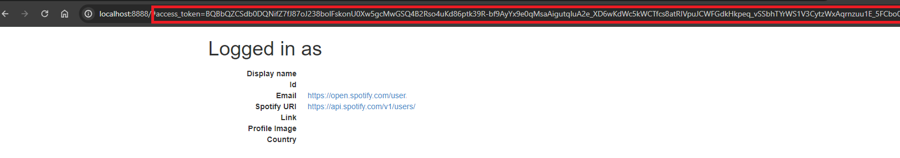
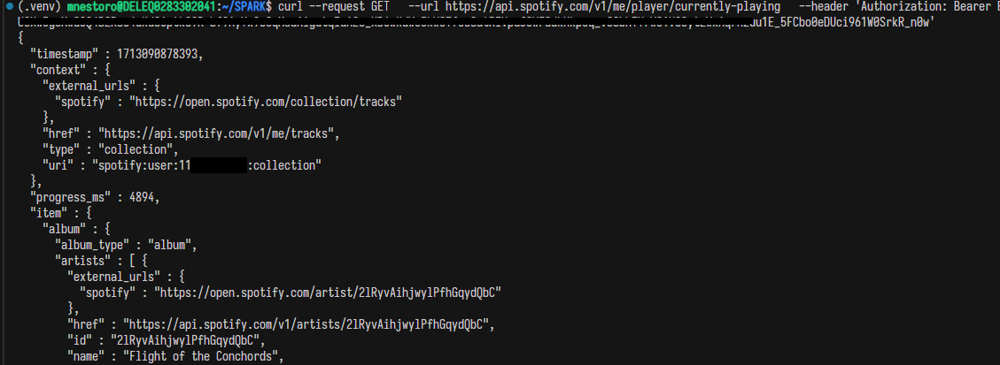

# Spotify Streaming application setup

For the final exercise, we will create recomendations app based on recently played tracks.
Luckily for us, Spotify has free [web API](https://developer.spotify.com/) for developers.

## Setup

### Prerequisites

1. Spotify Account (free or premium)
2. Installed Node.js
3. Installed curl (should be installed by default in WSL)

### Create an app

1. Go to [Dashboard](https://developer.spotify.com/dashboard)
2. Create an app
    * name and description: pick any name and description
    * redirect uri: `http://localhost:8888`

### Request an access token

To request token with necessary scope to read currently played track, we will use one of the example app provided by Spotify. For more example apps, go to [Spotify GitHub repository](https://github.com/spotify/web-api-examples/tree/master). Copy of the app we will use for granting implicit grant is under **implicit_grant** directory.

1. Go to [Dashboard](https://developer.spotify.com/dashboard)
2. Click on the App you have just created and to to the *Settings*
3. Get *Client Id*
4. Go to *Redirect Uri*, and add: `http://localhost:8888/callback/`

### Running implicit_grant web application

There are a lot of diffrent ways for requesting token, but ~~in Michalina's opinion~~ using provided by Spotify example app is one of the least problematic ones.

1. Go to terminal, change directory to **implicit_grant**
2. Install app dependencies running

```bash
npm install
```

3. Go to `public/index.html`:
    * line 134 -> change to your client_ID
    * line 135 -> change to youe redirect_uri, in this example use `http://localhost:8888/`
    * line 140 -> change scope to 'user-read-currently-playing'



4. Run app

```bash
npm start
```

5. Open `http://localhost:8888` in a browser and log in
6. After successfull login, copy `access_token` parameter from page url


### Check if request works

To check if generated token is able to request currently played track data, go to terminal

```bash
curl --request GET --url https://api.spotify.com/v1/me/player/currently-playing --header 'Authorization: Bearer <generated_token>'
```


